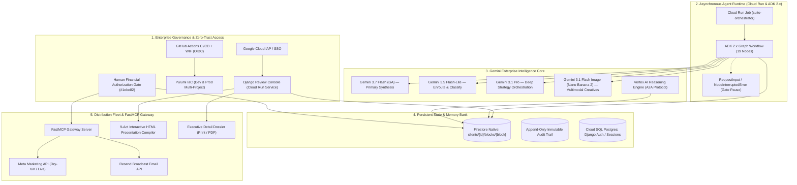

# Agentic Marketing Suite (`agentic-marketing-suite`)

[](https://www.python.org/)
[](https://cloud.google.com/)
[](https://deepmind.google/technologies/gemini/)
[](https://cloud.google.com/run)
[](https://cloud.google.com/firestore)
[](https://www.pulumi.com/)
[](tests/)

> **Next-Generation Institutional Multi-Agent Marketing Engine for Google Cloud & Gemini Enterprise**  
> Built for the **All Things Agentic Hackathon** · Category: **Fortified Enterprise Fleet** (also excelling in **Taskmaster**)  
> Powered by **Gemini 3.7 Flash**, **Google ADK 2.x Graph Workflows**, **Vertex AI Reasoning Engine**, **Cloud Run**, and **Firestore Native Memory Bank**.

---

## 1. Executive Overview

Digital marketing execution for modern enterprises is notoriously fragmented: market diagnostics, audience profiling, competitive radar, 90-day strategy formulation, 4-week editorial calendaring, multimodal creative production (copy, visuals, landing pages, email flows), campaign launching, and closed-loop performance analytics operate in isolated silos.

**Agentic Marketing Suite** solves this end-to-end multi-step chore by deploying a scalable fleet of **19 autonomous, institutional agents organized into 6 functional layers**. The system transitions beyond standard chat loops into an asynchronous, enterprise-grade runtime where agents manipulate structured data pipelines, maintain long-term memory across weeks, and execute real-world distribution workflows.

### Sacred Human-in-the-Loop Governance (`#1ebe82`)
True enterprise automation demands rigorous accountability. Agentic Marketing Suite enforces a non-negotiable **Human-in-the-Loop Gate** convention:
- **Zero Blind Spend:** No advertising campaign can be launched and no paid media budget can be committed without explicit human authorization in the review console.
- **Visual Gate Standard (`#1ebe82`):** Gated deliverable cards and approval buttons throughout the UI strictly use the institutional emerald `#1ebe82` identifier.
- **Interactive Editing & Downstream Re-execution:** Human reviewers can adjust any AI-generated copy, audience segment, or strategy directly in the UI. Downstream pipeline stages automatically re-run from the edited block onward.

---

## 2. High-Level System Architecture



---

## 3. The 6-Layer / 19-Agent Value Chain

The authoritative execution DAG is defined in [`suite/orchestration/pipeline.py`](suite/orchestration/pipeline.py) and executed via **Google ADK 2.x** in [`suite/orchestration/adk_workflow.py`](suite/orchestration/adk_workflow.py).

| Layer | Agent | Name | Mission & Memory Block Produced | Gate Tier |
| :--- | :---: | :--- | :--- | :---: |
| **Layer 1: Market Intelligence** | **1.1** | **Business Diagnostics** | Extracts business model, USP, brand identity & channels → `client_profile` | Human Review |
| | **1.2** | **Audience Intelligence** | Builds Ideal Customer Profiles (ICPs), pain points & purchase triggers → `audience_segments` | Human Review |
| | **1.3** | **Competitive Intelligence**| Maps direct/indirect rivals, positioning quadrants & gaps → `competitive_map` | Review-Only |
| | **1.4** | **Trend Radar** | Ingests market signals, seasonal hashtags & conversation trends → `trend_signals` | Autonomous |
| **Layer 2: Strategic Synthesis** | **2.1** | **Strategy Orchestrator** | 90-day growth thesis, budget allocation & SMART goals → `active_strategy` & `kpi_contracts` | **Binding Gate** |
| | **2.2** | **Campaign Planner** | Translates strategy into multi-channel campaign architectures → `campaign_registry` | Human Review |
| **Layer 3: Content Planning** | **3.1** | **Monthly Marketing Deck**| Formulates editorial themes, story arcs & channel splits → `content_plan` | Human Review |
| | **3.2** | **Content Scheduler** | Compiles 4-week publishing matrix with date/time slots → `content_calendar` | Human Review |
| | **3.3** | **Approval Workflow** | Validates content hygiene and manages human review queues → `approval_log` | Queue Manager |
| **Layer 4: Creative Factory** | **4.1** | **Copy + Prompt Engine** | Generates ad copy variations, headlines, body text & CTAs → `copy_assets` | Risk-Tiered |
| | **4.2** | **Visual Creative** | Synthesizes visual creative specifications & renders assets → `visual_assets` | Batch Review |
| | **4.3** | **Web & Landing Pages** | Generates high-converting landing page architectures & wireframes → `page_assets` | Full Review |
| | **4.4** | **Email & WhatsApp** | Builds automated nurture sequences and broadcast templates → `message_flows` | First Deploy |
| **Layer 5: Distribution & Ops** | **5.1** | **Campaign Launcher** | Configures paid media campaigns with budget safety guardrails → `ad_campaign_log` | **Financial Auth** |
| | **5.2** | **Social Publisher** | Formats and schedules social media broadcasts → `publish_log` | Autonomous |
| | **5.3** | **Lead Capture & Nurture**| Coordinates CRM webhook ingest and dynamic lead scoring → `lead_register` | Conditional |
| **Layer 6: Analytics & Feedback**| **6.1** | **Performance Analytics**| Tracks CPA, ROAS, CTR and compares against KPI contracts → `performance_history` | Auto + Alert |
| | **6.2** | **Client Reporting** | Calculates holistic client health score and executive KPIs → `client_health_score` | Pre-Client |
| | **6.3** | **Optimization Engine** | Closed-loop reinforcement: extracts content learnings for Layer 2 → `content_learnings` | Bounded-Auto |

---

## 4. Fortified Enterprise Fleet Alignment

Agentic Marketing Suite was architected from the ground up to satisfy the four enterprise pillars:

### 1. Discovery & Lifecycle (Agent Registry)
- **A2A Agent Card Standard:** Published under [`deploy/a2a/marketing_suite_agent_card.json`](deploy/a2a/marketing_suite_agent_card.json) conforming to the Google Gemini Enterprise A2A protocol.
- **OpenAPI Discovery Specification:** Fully documented in [`deploy/a2a/openapi_spec.yaml`](deploy/a2a/openapi_spec.yaml) for cross-department cataloging and autonomous agent-to-agent negotiation.
- **Vertex AI Reasoning Engine:** Exposes conversational access over the 19 agents via [`MarketingSuiteReasoningEngine`](suite/reasoning_engine/engine.py) and typed domain tools.

### 2. Core Execution & State (Runtime & Memory Bank)
- **ADK 2.x Graph Workflow:** Native directed acyclic graph (DAG) execution with explicit edges, state transitions, and `RequestInput` interrupts for long-running human pauses.
- **Firestore Native Memory Bank:** Document hierarchy (`clients/{client_id}/blocks/{block}`) preserving structured, typed memory blocks across weeks of asynchronous operation without split-brain risk.
- **Append-Only Audit Ledger:** Subcollection `clients/{client_id}/blocks/{block}/audit` records every write, gate decision, actor, and timestamp.

### 3. Security & Governance (Identity, Gateway & Model Armor)
- **Zero-Trust Identity (WIF):** GitHub Actions deploys via GCP Workload Identity Federation with short-lived OIDC tokens. Zero static credentials stored in repositories.
- **Direct Cloud Run IAP:** Identity-Aware Proxy enforces Google Workspace OIDC authentication directly on Cloud Run, eliminating public ingress without load-balancer costs.
- **Human Financial Authorization Gate (`financial_gate.py`):** FastMCP tool calls to external platforms (Meta Marketing API, Resend) are blocked unless the memory block has `gate_status="approved"` and the spend is strictly within the client's confirmed budget ceiling.
- **Model Armor with Google Gemma (`suite/security/model_armor.py`):** Inline perimeter defense leveraging Google Gemma (`gemma-2-9b-it`) and deterministic heuristic engines to intercept prompt injection attacks, sanitize PII (credit cards, SSNs, Google API keys, bearer tokens), and block tool poisoning (SQL and shell injection in tool parameters).

### 4. Telemetry & Observability
- **Audit Logging:** Every agent execution, validation outcome, gate status transition, and human edit is persisted to Firestore and Cloud Logging.
- **Cost & Token Telemetry:** Synchronous tracking of prompt tokens, candidate tokens, and latency across Gemini model tiers.

---

## 5. Step-by-Step Spin-Up Instructions

### Prerequisites
- **Python 3.12**
- **uv** package manager: `curl -LsSf https://astral.sh/uv/install.sh | sh`
- *(Optional for cloud deploy)*: Google Cloud SDK (`gcloud`) & Pulumi CLI

---

### Step 1: Clone and Install Locally

```bash
# Clone the repository
git clone https://github.com/jaimevelarca/agentic-marketing-suite.git
cd agentic-marketing-suite

# Sync dependencies into project virtual environment (Python 3.12)
uv sync --all-extras
```

---

### Step 2: Verify the Offline Test Suite (335 Tests)

The suite includes an inviolable offline contract: all agents, schemas, rendering engines, and security gates run hermetically with zero API keys and zero cloud dependencies:

```bash
uv run --all-extras pytest -q
# Expected output: 335 passed, 1 warning in ~5s
```

---

### Step 3: Run the 19-Agent Pipeline Demo Offline

Execute the complete end-to-end 19-agent workflow using canned fixture outputs and in-memory persistence:

```bash
PYTHONPATH=suite uv run python -m orchestration.demo
# Output: 19/19 agents executed and validated successfully
```

---

### Step 4: Launch the Local Django Review Console

Run the interactive human-in-the-loop web console on your machine:

```bash
# Apply local SQLite migrations for Django sessions/auth
PYTHONPATH=web:suite uv run python web/manage.py migrate

# Create a local reviewer user
PYTHONPATH=web:suite uv run python web/manage.py createsuperuser --username admin --email admin@example.com

# Start the review console
PYTHONPATH=web:suite uv run python web/manage.py runserver 0.0.0.0:8000
```
Open `http://localhost:8000` in your browser. You can:
1. Complete the interactive **Onboarding Wizard** (`/corridas/nueva/`).
2. Inspect the **Live Pipeline State** (`/corridas/<session_id>/`).
3. Review, edit, and approve gated deliverables with the `#1ebe82` button (`/clientes/<client_id>/bloques/<block>/`).
4. Generate standalone **9-Act HTML Presentation Decks** and **Executive PDF Reports** (`/propuestas/<client_id>/presentacion/`).

---

### Step 5: Cloud Deployment with Pulumi (GCP)

Infrastructure as Code is managed entirely through Python Pulumi in `infra/`:

```bash
cd infra

# Authenticate Pulumi state to Google Cloud Storage
pulumi login gs://agentic-marketing-suite-pulumi-state

# Select environment stack (dev or prod)
pulumi select dev

# Preview and deploy infrastructure
pulumi up
```

Pulumi automatically provisions:
- Firestore Native database `(default)`
- Cloud Run service `console` (with Direct IAP enabled and `cpu_idle: true`)
- Cloud Run job `suite-orchestrator`
- Cloud SQL PostgreSQL instance `console-pg` (auth only)
- Artifact Registry Docker repository `suite`
- Secret Manager containers & Pub/Sub topics
- Workload Identity Federation provider for CI/CD

---

## 6. Model Routing & Serverless Cost Architecture

Agentic Marketing Suite implements an intelligent three-tier model routing strategy via Google Vertex AI:

| Tier | Gemini Model | Assigned Pipeline Roles | Economic Impact |
| :--- | :--- | :--- | :--- |
| **Routing / Light** | `gemini-3.5-flash-lite` | Intent classification, schema routing, trend filtering | Ultra-low latency, negligible cost |
| **Primary Synthesis** | `gemini-3.7-flash` (GA) | Diagnostics, copywriting, calendar planning, code generation | 2026 flagship speed, structured JSON mode |
| **Deep Reasoning** | `gemini-3.1-pro-preview` | Layer 2 Strategy Orchestration (Agent 2.1) | Deep analytical synthesis for 90-day thesis |
| **Multimodal Creative**| `gemini-3.1-flash-image` | High-fidelity visual asset generation (Nano Banana 2) | Instant visual rendering with aspect-ratio control |

### Zero Idle Spend ($0.00 / month Compute)
Cloud Run services are configured with `cpu_idle: true`. Compute instances scale to **zero** when no requests are being processed. Organizations pay **$0.00** for idle compute, with costs incurred strictly per active request or job execution.

---

## 7. Hackathon Submission Deliverables

- **Live Hosted URL:** [`https://console-m6hls6q6ua-uc.a.run.app`](https://console-m6hls6q6ua-uc.a.run.app) (Direct Cloud Run IAP)
- **Repository:** [`https://github.com/jaimevelarca/agentic-marketing-suite`](https://github.com/jaimevelarca/agentic-marketing-suite)
- **Target Category:** **Fortified Enterprise Fleet**
- **Testing & Evaluation Access for Judges:**
  - Authorized testing emails: `testing@devpost.com`, `cloudhackathons@google.com`.
  - Offline reproducible test suite: `uv run --all-extras pytest -q` (335 tests green).
  - Corporate English Onboarding Contract: [`suite/inputs/acme_global.json`](suite/inputs/acme_global.json).
  - Standard Onboarding Contract: [`suite/inputs/acme.json`](suite/inputs/acme.json).
- **Architecture Highlights:** Google ADK 2.x · Gemini 3.7 Flash · Vertex AI Reasoning Engine · Cloud Run · Firestore Native Memory Bank · Pulumi IaC · FastMCP · Model Armor (Google Gemma).

---

## 8. License

Internal proprietary software developed by **Que Hueva Hacerlo Enterprise (QHHE)**. Built and submitted for the **All Things Agentic Hackathon**.

